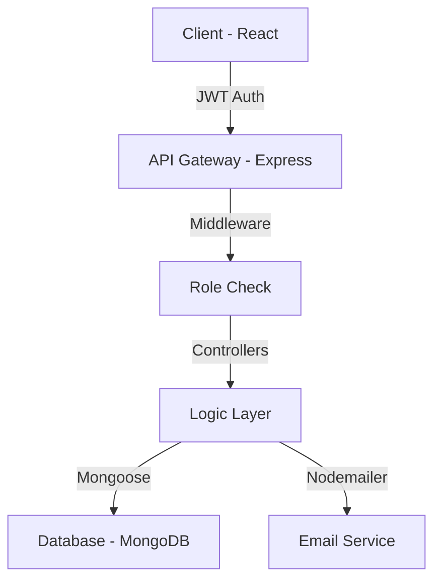

# 👔 HRMS - Human Resource Management System

[](https://mongodb.com)
[](https://reactjs.org)
[](https://nodejs.org)
[](https://opensource.org/licenses/MIT)

A sophisticated, full-stack Human Resource Management System designed to streamline organizational workflows. This project demonstrates high-level implementation of **Role-Based Access Control (RBAC)**, real-time data synchronization, and a seamless multi-user experience.

---

## 🌟 Project Impact

This isn't just a basic CRUD app. It is a robust enterprise-ready solution that addresses real-world HR challenges:

- **Dual-Session Integrity**: Solved the common "Session Overwrite" problem. Admin and Employees can operate simultaneously in different tabs without cross-authentication issues.
- **Automated Communication**: Integrated email and in-app notification systems to ensure transparency in leave management.
- **Data-Driven Insights**: Comprehensive reporting tools for attendance and leave cycles.

---

## 📸 Dashboard Preview

> **Note**: Add your stunning screenshots here to wow your visitors!

---

## 🚀 Core Functionalities

### 🛡️ Administrative Power
- **Full Employee Lifecycle**: Manage staff from onboarding (Add) to offboarding (Remove).
- **Intelligent Leave Processing**: A dedicated workspace to approve or reject requests with automated feedback loops.
- **Advanced Attendance Analytics**: Searchable and filterable data to track punctuality and trends.

### 👤 Employee Experience
- **Interactive Dashboard**: Real-time summary of personal profile and records.
- **One-Click Attendance**: Efficient check-in system with duplicate prevention logic.
- **Transparency**: Detailed leave history with status tracking and instant notifications.

---

## 🛠️ Technical Architecture



- **Frontend**: Optimized with **Vite** for blazing-fast performance.
- **State Management**: Built-in React Context API for lightweight, efficient state handling.
- **Security**: 
  - JWT (JSON Web Tokens) for secure, stateless authentication.
  - Bcrypt for high-security password hashing.
  - Helmet & CORS for backend protection.

---

## ⚙️ Quick Start

### Prerequisites
- Node.js (v14+)
- MongoDB (Local or Atlas)

### Setup
1. **Clone & Install**:
   ```bash
   git clone https://github.com/mohd-usman444/HRMS-Project.git
   cd HRMS-Project
   cd server && npm install
   cd ../client && npm install
   ```

2. **Environment Variables**:
   Configure your `server/.env` with your Mongo URI and SMTP credentials to enable the notification engine.

3. **Launch**:
   ```bash
   # Terminal 1 (Server)
   npm run dev
   # Terminal 2 (Client)
   npm run dev
   ```

---

## 🗺️ Roadmap
- [ ] Shift Tracking & Scheduling
- [ ] Payroll Integration
- [ ] Performance Review Module
- [ ] Export Reports to PDF/Excel

---

## 🤝 Contributing
Contributions, issues, and feature requests are welcome! Feel free to check the [issues page](https://github.com/mohd-usman444/HRMS-Project/issues).

---

**Show your support by giving a ⭐️ if this project inspired you!**

Created with ❤️ by [Mohd Usman](https://github.com/mohd-usman444)
